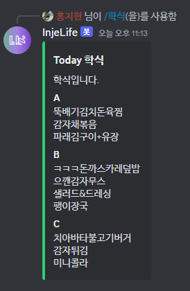
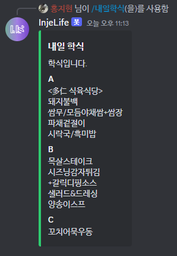
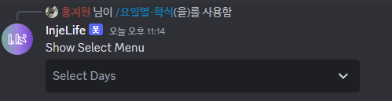
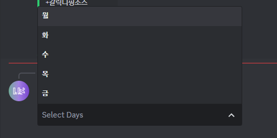
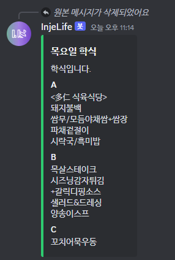

# InjeLife-DiscrodBot
인제생 디스코드 봇입니다.

# 개발 환경
- Langauge : C# Discord.Net
- Library : Discord.Net https://discordnet.dev/guides/int_framework/intro.html

# 배포 방식
### C# Linux Build
- 먼저 .sln이 아닌 .csproj가 들어가 있는 폴더에서 cmd 창을 연다.
- ``` dotnet publish -r linux-x64 ```
- bin/Debug/net6.0 에 linux-x64 폴더 생성
- 이후 리눅스로 옮김(본인은 WIN-SCP 사용)

### 리눅스 실행 명령어
``` nohup dotnet InjeDiscordBot.dll & ```

# 코드 소개
[DiscordBotMain.cs](InjeLifeDiscordBot/DiscordBotMain.cs) : 의존성 주입 및 초기화 담당하는 클래스

[InteractionHandler.cs](InjeLifeDiscordBot/InteractionHandler.cs) : SlashCommand 함수를 추가 해주는 클래스

[InterationModule.cs](InjeLifeDiscordBot/Modules/InterationModule.cs) : 각 SlashCommand를 처리하는 클래스

[SQLManager.cs](InjeLifeDiscordBot/Utils/SQLManager.cs) : SQL에서 리스트를 받아와서 정리해주는 클래스

# 기능
### /학식 기능


### /내일학식 기능


### /요일별-학식 기능






### /채널고정
- 특정 채널에서만 사용하고 싶을 때 사용하는 기능으로, 특정 채널에서 /채널고정을 하게 되면 다른 채널에서는 봇 사용 불가

### /채널고정해제
- 채널고정되어 있는 것을 해제하는 코드로 어디서든 사용 가능합니다.
